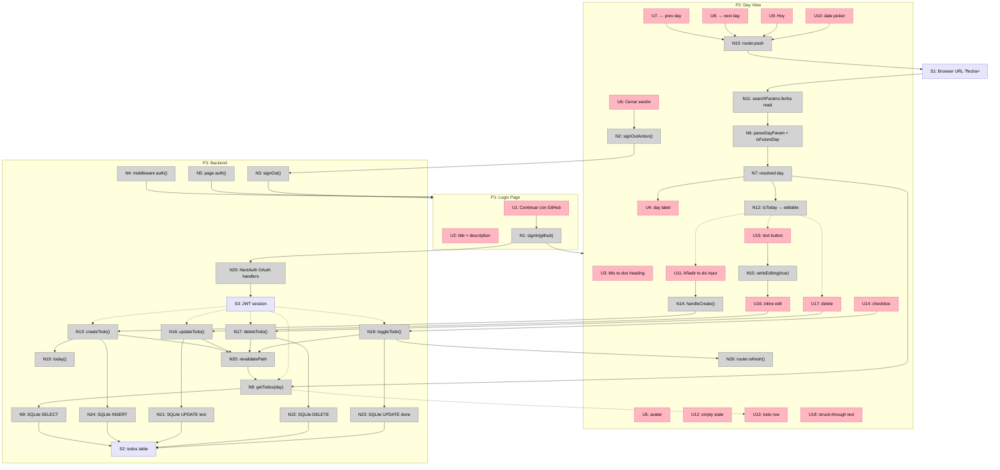

# To-dos Diarios — Breadboard

Mapeo del sistema **CURRENT** implementado. Basado en `shaping.md`.

**Workflow principal:** Usuario no autenticado → login GitHub → ve to-dos del día → navega a día pasado → marca done → vuelve a hoy → crea/edita/elimina to-do.

---

## Places

| # | Place | Description |
|---|-------|-------------|
| **P1** | Login Page | Entrada sin sesión; botón OAuth GitHub |
| **P2** | Day View | Una página, un día: navegación, lista, CRUD (solo hoy), toggle done |
| **P3** | Backend | Server actions, SQLite, NextAuth handlers, middleware |

---

## UI Affordances

| # | Place | Component | Affordance | Control | Wires Out | Returns To |
|---|-------|-----------|------------|---------|-----------|------------|
| **U1** | P1 | login/page | "Continuar con GitHub" button | click | → N1 | — |
| **U2** | P1 | login/page | title + description copy | render | — | — |
| **U3** | P2 | page | "Mis to-dos" heading | render | — | — |
| **U4** | P2 | page | day label (`formatDayLabel`) | render | — | — |
| **U5** | P2 | UserMenu | avatar / initial | render | — | — |
| **U6** | P2 | UserMenu | "Cerrar sesión" button | click | → N2 | — |
| **U7** | P2 | DateNav | ← día anterior | click | → N10 | — |
| **U8** | P2 | DateNav | → día siguiente (disabled en hoy) | click | → N10 | — |
| **U9** | P2 | DateNav | "Hoy" button | click | → N10 | — |
| **U10** | P2 | DateNav | `<input type="date">` selector | change | → N10 | — |
| **U11** | P2 | TodoApp | "Añadir to-do…" input | submit | → N14 | — |
| **U12** | P2 | TodoApp | "No hay to-dos este día" empty state | render | — | — |
| **U13** | P2 | TodoItem | todo row | render | — | — |
| **U14** | P2 | TodoItem | done checkbox | change | → N18 | — |
| **U15** | P2 | TodoItem | todo text button | click | → N15 | — |
| **U16** | P2 | TodoItem | inline edit input | blur / Enter | → N16 | — |
| **U17** | P2 | TodoItem | 🗑 delete button | click | → N17 | — |
| **U18** | P2 | TodoItem | struck-through text (done) | render | — | — |

**Condicionales en P2 (mismo Place, estado local):**

| Condición | Affordances visibles |
|-----------|---------------------|
| `editable === true` (hoy) | U11, U15 (edit), U16 (editing), U17 |
| `editable === false` (pasado) | U14 solo; sin U11, U15 edit, U17 |
| `todos.length === 0` | U12 |
| `todo.done === true` | U18 |

---

## Code Affordances

| # | Place | Component | Affordance | Control | Wires Out | Returns To |
|---|-------|-----------|------------|---------|-----------|------------|
| **N1** | P1 | login/page | `signIn("github", { redirectTo: "/" })` | call | → N25 | → P2 |
| **N2** | P2 | lib/actions/auth | `signOutAction()` | call | → N3 | — |
| **N3** | P3 | auth | `signOut({ redirectTo: "/login" })` | call | → P1 | — |
| **N4** | P3 | middleware | `auth()` route guard | observe | → P1 | — |
| **N5** | P2 | app/page | `auth()` + redirect if no session | call | → P1 | — |
| **N6** | P2 | app/page | `parseDayParam()` + `isFutureDay()` | call | — | → N7 |
| **N7** | P2 | app/page | resolved `day` value | write | — | → U4, → N8, → N12 |
| **N8** | P3 | lib/actions/todos | `getTodos(day)` | call | → N9 | → U13 |
| **N9** | P3 | lib/db | SQLite SELECT `userId + day` ORDER BY `createdAt` | query | — | → N8 |
| **N10** | P2 | DateNav | `router.push("/" \| "/?fecha=")` | call | → S1 | — |
| **N11** | P2 | app/page | `searchParams.fecha` read | read | — | → N6 |
| **N12** | P2 | TodoApp | `isToday(day)` → `editable` | call | — | → U11, U15, U17 |
| **N13** | P3 | lib/actions/todos | `createTodo(text)` | call | → N19, → N24, → N20 | — |
| **N14** | P2 | TodoApp | `handleCreate()` | call | → N13 | — |
| **N15** | P2 | TodoItem | `setIsEditing(true)` | call | → U16 | — |
| **N16** | P3 | lib/actions/todos | `updateTodo(id, text)` | call | → N21, → N20 | — |
| **N17** | P3 | lib/actions/todos | `deleteTodo(id)` | call | → N22, → N20 | — |
| **N18** | P3 | lib/actions/todos | `toggleTodo(id, done)` | call | → N23, → N20 | — |
| **N19** | P3 | lib/dates | `today()` | call | — | → N13, → N12 |
| **N20** | P3 | next/cache | `revalidatePath("/")` | call | → N8 | — |
| **N21** | P3 | lib/db | SQLite UPDATE text (guard `day === today()`) | write | → S2 | — |
| **N22** | P3 | lib/db | SQLite DELETE (guard `day === today()`) | write | → S2 | — |
| **N23** | P3 | lib/db | SQLite UPDATE `done` | write | → S2 | — |
| **N24** | P3 | lib/db | SQLite INSERT todo | write | → S2 | — |
| **N25** | P3 | auth + api/auth | NextAuth GitHub OAuth handlers | call | — | → S3 |
| **N26** | P2 | TodoApp | `router.refresh()` | call | → N5, → N8 | — |

---

## Data Stores

| # | Place | Store | Description |
|---|-------|-------|-------------|
| **S1** | P2 | Browser URL (`?fecha=YYYY-MM-DD`) | Día seleccionado; `max=today` en picker; futuros bloqueados en `DateNav` y `page.tsx` |
| **S2** | P3 | SQLite `todos` table | `id`, `userId`, `text`, `done`, `day`, `createdAt` en `data/todo.db` |
| **S3** | P3 | NextAuth JWT session | `session.user.id = token.sub`; scope por usuario en queries |

---

## Workflow Guide

| Step | Action | Where to look |
|------|--------|---------------|
| **1** | Usuario sin sesión llega a `/` | N4 → P1 |
| **2** | Click "Continuar con GitHub" | U1 → N1 → N25 → S3 → P2 |
| **3** | Página carga to-dos de hoy | N11 → N6 → N7 → N8 → N9 → U13 |
| **4** | Crear to-do (hoy) | U11 → N14 → N13 → N19, N24 → S2 → N20 → N8 |
| **5** | Editar texto (hoy) | U15 → U16 → N16 → N21 → S2 → N20 |
| **6** | Eliminar (hoy) | U17 → N17 → N22 → S2 → N20 |
| **7** | Marcar done (cualquier día) | U14 → N18 → N23 → S2 → N20 |
| **8** | Navegar a día pasado | U7/U10 → N10 → S1 → N11 → N6 → N8 |
| **9** | Cerrar sesión | U6 → N2 → N3 → P1 |

---

## Mermaid Diagram

---

## Verification

| Check | Result |
|-------|--------|
| Every display U has data source | ✅ U13 ← N8; U4 ← N7; U12 ← empty list |
| Every N has Wires Out or Returns To | ✅ |
| Navigation wired to Places | ✅ N1→P2, N3→P1, N4→P1 |
| External state modeled as stores | ✅ S1 URL, S3 session |
| Backend as Place | ✅ P3 with S2 + resolvers |
| Matches `shaping.md` CURRENT parts | ✅ |
